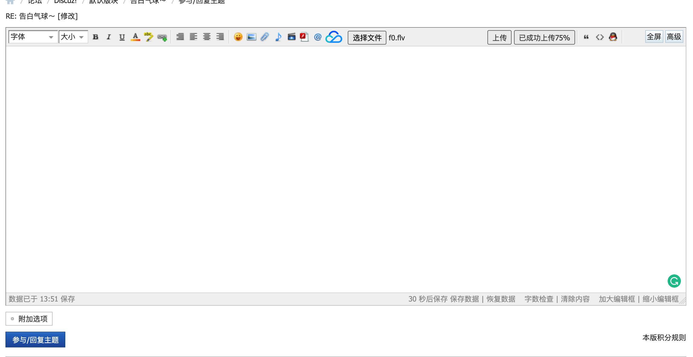
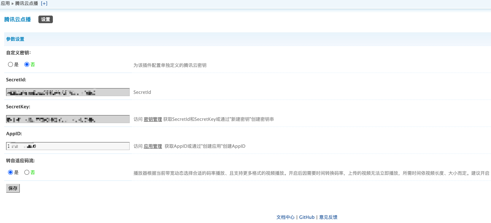

# 腾讯云点播插件

## 1.插件介绍

> tencentcloud_vod插件是一款腾讯云研发的，提供给DiscuzX站长使用的官方插件。使Discuz! X能快捷使用腾讯云云点播（VOD）产品功能的插件

| 标题   | 内容                                                     |
| ---- | ------------------------------------------------------ |
| 中文名称 | 腾讯云点播（VOD）插件                                           |
| 英文名称 | tencentcloud_vod                                       |
| 最新版本 | v1.0.0 (2020.08.17)                                    |
| 适用平台 | [Discuz! X](https://www.discuz.net/forum.php)          |
| 适用产品 | [腾讯云点播（VOD）](https://cloud.tencent.com/product/vod)    |
| 文档中心 | [春雨文档中心](https://openapp.qq.com/docs/DiscuzX/vod.html) |
| 主创团队 | 腾讯云中小企业产品中心（SMB Product Center of Tencent Cloud）       |

## 2.功能特性

- 支持在发帖时上传视频
- 用户观看视频不占用本站带宽

## 3.安装指引

### 3.1.部署方式一：通过GitHub部署安装

> 1. git clone https://github.com/Tencent-Cloud-Plugins/tencentcloud-discuzx-plugin-vod.git
> 2. 复制 tencentcloud_vod文件夹 到Discuz安装路径/source/plugins/文件夹里面

## 4.使用指引

### 4.1.界面功能介绍

> 点击"云点播"按钮，将出现选择文件的按钮，上传后将会在文本框，插入[tcplayer]XXXXXX[/tcplayer].

> 帖子发布后[tcplayer]XXXXXX[/tcplayer]将会被解析成视频。如上图

> 后台配置页面。配置介绍请参考下方的[名词解释](#_4-2-名词解释)

### 4.2.名词解释

- **自定义密钥：** 插件提供统一密钥管理，既可在多个腾讯云插件之间共享SecretId和SecretKey，也可为插件配置单独定义的腾讯云密钥。
- **Secret ID：** 在[腾讯云API密钥管理](https://console.cloud.tencent.com/cam/capi)上申请的标识身份的 SecretId。
- **Secret Key：** 在[腾讯云API密钥管理](https://console.cloud.tencent.com/cam/capi)上申请的与SecretId对应的SecretKey。
- **AppID：** 在[腾讯云点播应用管理](https://console.cloud.tencent.com/vod/app-manage)上创建的应用ID。
- **转自适应码流：** 根据用户网络带宽动态选择合适码率播放，支持多种格式视频播放，但可能导致上传后的视频因转换码率而无法实时播放。请根据情况开启。详细解释参照[腾讯云文档](https://cloud.tencent.com/document/product/266/34071)

## 5.获取入口

| 插件入口   | 链接                                                                               |
| ------ | -------------------------------------------------------------------------------- |
| GitHub | [link](https://github.com/Tencent-Cloud-Plugins/tencentcloud-discuzx-plugin-vod) |

## 6.FAQ

> 1. Q:视频解析报错：无法找到此视频兼容的源或者当前环境无法播放该视频、视频解码时发生错误
>    
>    A: 1：后台开启转自适应码流，再重新上传。
>    
>    2：如后台已开启，请稍等一会再刷新网页。

## 7.GitHub版本迭代记录

### 7.1 tencentcloud-discuzx-plugin-vod v1.0.0

- 支持在发帖时上传视频
